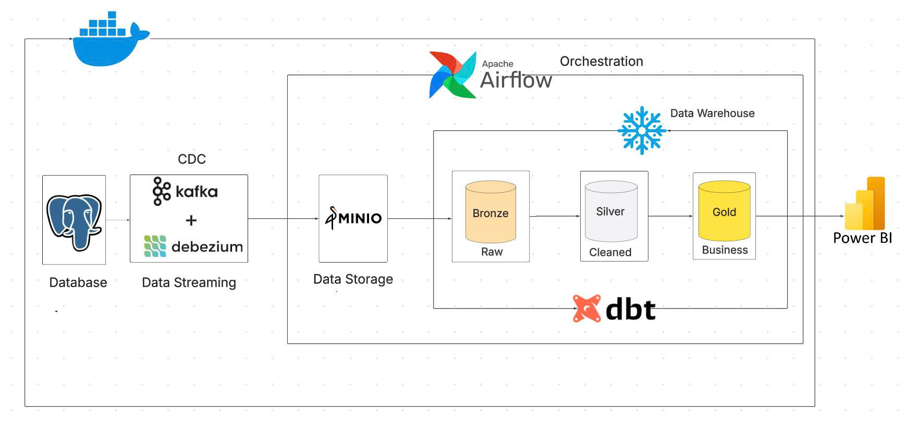
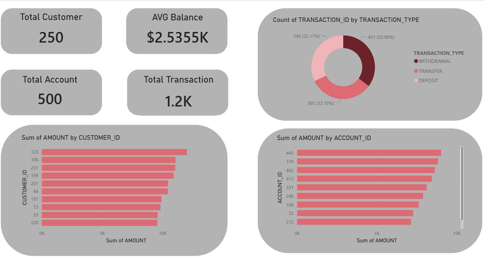

# Banking Lakehouse Pipeline

This project simulates an end-to-end banking data pipeline using a lakehouse-style architecture. Fake banking data is generated into PostgreSQL, captured through Debezium CDC, streamed through Kafka, stored as Parquet files in MinIO, loaded into Snowflake, transformed with dbt, and visualized in Power BI.



## Goals

- Simulate a banking source system with `customers`, `accounts`, and `transactions`.
- Build a CDC pipeline from PostgreSQL to Kafka using Debezium.
- Store raw data as Parquet files in MinIO to simulate a data lake.
- Load raw data into Snowflake and organize it into `raw`, `staging`, and `marts` layers.
- Use dbt to build staging models, facts, dimensions, and SCD Type 2 snapshots.
- Use Airflow to orchestrate data loading and dbt jobs.

## Data Flow

1. `data-generator/faker_generator.py` generates fake banking records into PostgreSQL.
2. Debezium reads PostgreSQL WAL changes and publishes CDC events to Kafka topics:
   - `banking_server.public.customers`
   - `banking_server.public.accounts`
   - `banking_server.public.transactions`
3. `kafka/consumer/kafka_to_minio.py` consumes Kafka events, batches records, and writes Parquet files to the MinIO `raw` bucket.
4. Airflow DAG `minio_to_snowflake_banking` downloads Parquet files from MinIO and loads them into Snowflake raw tables.
5. Airflow DAG `SCD2_snapshots` runs `dbt snapshot` and `dbt run --select marts`.
6. Power BI reads the mart layer from Snowflake to build the dashboard.

## Tech Stack

| Component | Technology |
| --- | --- |
| Source database | PostgreSQL 15 |
| CDC | Debezium, Kafka Connect |
| Streaming | Apache Kafka, ZooKeeper |
| Object storage | MinIO |
| Orchestration | Apache Airflow |
| Data warehouse | Snowflake |
| Transformation | dbt, dbt-snowflake |
| Visualization | Power BI |
| Data generator | Python, Faker |

## Repository Structure

```text
.
+-- banking_dbt/                  # dbt project: staging, marts, snapshots
+-- data-generator/               # Fake banking data generator
+-- docker/dags/                  # Airflow DAGs
+-- images/                       # Architecture and dashboard images
+-- kafka/consumer/               # Kafka consumer that writes data to MinIO
+-- kafka/kafka-debezium/         # Debezium connector creation script
+-- postgres/                     # PostgreSQL source table DDL
+-- docker-compose.yml            # Local infrastructure
+-- dockerfile-airflow.dockerfile # Airflow image with dbt installed
+-- requirements.txt              # Python dependencies
```

## Prerequisites

- Docker and Docker Compose.
- Python 3.10 or later.
- A Snowflake account with permission to create databases, schemas, tables, and run a warehouse.
- Power BI Desktop if you want to open or rebuild the dashboard.

## Environment Configuration

Create local `.env` files from the examples:

```bash
cp .env.example .env
cp data-generator/.env.example data-generator/.env
cp kafka/kafka-debezium/.env.example kafka/kafka-debezium/.env
cp kafka/consumer/.env.example kafka/consumer/.env
cp docker/dags/.env.example docker/dags/.env
```

Review the main environment groups:

- `.env`: credentials for PostgreSQL, MinIO, and the Airflow metadata database.
- `data-generator/.env`: host-to-PostgreSQL connection through `localhost:5432`.
- `kafka/kafka-debezium/.env`: Debezium-to-PostgreSQL connection through Docker hostname `postgres`.
- `kafka/consumer/.env`: Kafka broker `localhost:29092` and MinIO endpoint `http://localhost:9000`.
- `docker/dags/.env`: MinIO credentials inside Docker and Snowflake credentials.

On Linux, set `AIRFLOW_UID` in `.env` to the output of:

```bash
id -u
```

## Install Python Dependencies

The Debezium connector script, Kafka consumer, and data generator run from the host machine:

```bash
python -m venv .venv
source .venv/bin/activate
pip install -r requirements.txt
```

## Start Local Infrastructure

Build the Airflow image and start the base services:

```bash
docker compose build
docker compose up -d postgres zookeeper kafka connect minio airflow-postgres
```

Initialize the Airflow metadata database and create an admin user:

```bash
docker compose run --rm --no-deps airflow-webserver airflow db migrate
docker compose run --rm --no-deps airflow-webserver airflow users create \
  --username admin \
  --password admin \
  --firstname Admin \
  --lastname User \
  --role Admin \
  --email admin@example.com
docker compose up -d airflow-webserver airflow-scheduler
```

Main local services:

| Service | URL |
| --- | --- |
| Airflow | http://localhost:8080 |
| MinIO Console | http://localhost:9001 |
| Debezium Connect API | http://localhost:8083 |
| PostgreSQL | `localhost:5432` |
| Kafka broker from host | `localhost:29092` |

## Create PostgreSQL Source Tables

Run the DDL for the three source tables:

```bash
docker compose exec -T postgres psql -U postgres -d banking < postgres/create_table.sql
```

If you changed `POSTGRES_USER` or `POSTGRES_DB` in `.env`, update the `-U` and `-d` values accordingly.

## Create the Debezium Connector

```bash
python kafka/kafka-debezium/create_debezium_connector.py
```

The connector watches these source tables:

- `public.customers`
- `public.accounts`
- `public.transactions`

## Run the Streaming Pipeline

Open one terminal for the Kafka consumer:

```bash
source .venv/bin/activate
python kafka/consumer/kafka_to_minio.py
```

Open another terminal for the data generator:

```bash
source .venv/bin/activate
python data-generator/faker_generator.py
```

To generate only one batch and exit:

```bash
python data-generator/faker_generator.py --once
```

The consumer writes Parquet files to MinIO using this layout:

```text
s3://raw/customers/date=YYYY-MM-DD/*.parquet
s3://raw/accounts/date=YYYY-MM-DD/*.parquet
s3://raw/transactions/date=YYYY-MM-DD/*.parquet
```

## Prepare Snowflake

Create the database, schemas, and raw tables used by the Airflow load DAG:

```sql
CREATE DATABASE IF NOT EXISTS banking;
CREATE SCHEMA IF NOT EXISTS banking.raw;
CREATE SCHEMA IF NOT EXISTS banking.analytics;

CREATE TABLE IF NOT EXISTS banking.raw.customers (v VARIANT);
CREATE TABLE IF NOT EXISTS banking.raw.accounts (v VARIANT);
CREATE TABLE IF NOT EXISTS banking.raw.transactions (v VARIANT);
```

Update Snowflake credentials in:

- `docker/dags/.env`
- `banking_dbt/.dbt/profiles.yml`

Do not commit real credentials to the repository. For shared environments, use example files or a secret manager.

## Run Airflow and dbt

Open Airflow at http://localhost:8080 and log in with:

- Username: `admin`
- Password: `admin`

Enable and trigger the DAGs in this order:

1. `minio_to_snowflake_banking`: loads Parquet data from MinIO into Snowflake raw tables.
2. `SCD2_snapshots`: runs dbt snapshots and builds the mart layer.

You can also validate dbt directly from the host:

```bash
cd banking_dbt
dbt debug --profiles-dir .dbt
dbt snapshot --profiles-dir .dbt
dbt run --select marts --profiles-dir .dbt
```

## dbt Models

| Layer | Model | Purpose |
| --- | --- | --- |
| Staging | `stg_customer` | Standardizes customer raw events and keeps the latest record per `customer_id` |
| Staging | `stg_account` | Standardizes account raw events and keeps the latest record per `account_id` |
| Staging | `stg_transaction` | Standardizes transaction raw events |
| Snapshot | `customers_snapshot` | Tracks customer changes using SCD Type 2 |
| Snapshot | `accounts_snapshot` | Tracks account changes using SCD Type 2 |
| Mart | `dim_customer` | Time-aware customer dimension |
| Mart | `dim_account` | Time-aware account dimension |
| Mart | `fact_transaction` | Incremental transaction fact table keyed by `transaction_id` |

## Dashboard

The Power BI dashboard shows high-level banking metrics such as total customers, total accounts, total transactions, average balance, and transaction distribution by type.



## Stop the Environment

```bash
docker compose down
```

To also remove local volumes and runtime state:

```bash
docker compose down -v
```

## Troubleshooting

- Debezium connector cannot be created: check that the `connect` container is running and `http://localhost:8083/connectors` is available.
- No Kafka messages appear: check that PostgreSQL logical replication is enabled in `docker-compose.yml` and that new rows exist in the source tables.
- Consumer does not write to MinIO: check `kafka/consumer/.env`, the `raw` bucket, and MinIO credentials.
- Airflow fails to load Snowflake: check that raw tables exist, the warehouse is running, and credentials in `docker/dags/.env` are correct.
- dbt profile fails: check `banking_dbt/.dbt/profiles.yml`, Snowflake account, role, warehouse, database, and schema.
